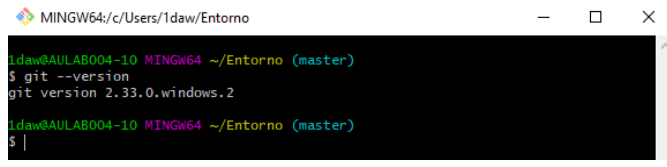

# ENTORNOS DE DESARROLLO #

## UT1. - Elementos de desarrollo del software ##

1. Desarrollo de software(metodologias tradicionales)

    i. Modelo en cascada 

    ii. Modelos evolutivos
2. Metodologias agiles 

## UT2. -Instalacion y uso de entornos de desarrollo

- Intelli J DEA 

- Elipse 

- Netbeans 

## UT3. -Sistemas de control de versiones 
````
 git --version
````

Todo esta en el [Aula Virtual](https://aulavirtual33.educa.madrid.org/ies.quevedo.madrid/mod/assign/view.php?id=55417)


